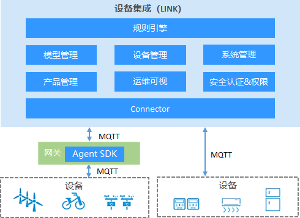

# ThingLinks平台简介

本系统采用Spring Cloud 微服务架构,一款高性、高吞吐量、高扩展性的物联网平台! 单机可以支持百万链接,同时支持自定义扩展功能多种协议交互，支持插件化开发! 

## 技术栈

1、采用前后端分离的模式，前端框架VUE。

2、后端采用Spring Boot、Spring Cloud & Alibaba。

3、MqttBroker(支持集群化部署)基于Netty、Reactor3、Reactor-netty。

4、注册中心、配置中心选型Nacos，权限认证使用Redis。

5、流量控制框架选型Sentinel，分布式事务选型Seata。

6、时序数据库采用TDengine开源、高效的物联网大数据平台、处理物联网海量数据写入与负载查询。

## 核心特性

支持统一产品模型管理,多种设备,多种厂家,统一设备连接管理,多协议适配(TCP,MQTT,UDP,CoAP,HTTP等)。

灵活的规则引擎,设备告警,消息通知,数据转发。

设备地理位置可视化查看,可视化大屏。

## 系统模块

~~~
com.mqttsnet.thinglinks     
├── thinglinks-ui              // 前端框架 [19000]
├── thinglinks-gateway         // 网关模块 [19100]、[sentinel:19101]
├── thinglinks-auth            // 认证中心 [19200]
├── thinglinks-api             // 接口模块
│       └── thinglinks-api-system                          // 系统接口
├── thinglinks-common          // 通用模块
│       └── thinglinks-common-core                         // 核心模块
│       └── thinglinks-common-datascope                    // 权限范围
│       └── thinglinks-common-datasource                   // 多数据源
│       └── thinglinks-common-job                          // 分布式定时任务
│       └── thinglinks-common-kafka                        // kafka消息服务
│       └── thinglinks-common-log                          // 日志记录
│       └── thinglinks-common-redis                        // 缓存服务
│       └── thinglinks-common-rocketmq                     // rocketmq消息服务
│       └── thinglinks-common-security                     // 安全模块
│       └── thinglinks-common-swagger                      // 系统接口
├── thinglinks-modules         // 业务模块
│       └── thinglinks-modules-file                        // 文件服务 [19300]
│       └── thinglinks-modules-gen                         // 代码生成 [19301]
│       └── thinglinks-modules-job                         // 定时任务 [19302]
│       └── thinglinks-modules-system                      // 系统模块 [19303]
│       └── thinglinks-modules-tdengine                    // TDengine服务 [19304]
│       └── thinglinks-modules-link                        // Link服务 [19305]
        └── thinglinks-modules-broker                      // broker服务 [19306]、[MQTT-TCP:11883]、[MQTT-SSL:18443]、[MQTT-WS:18999]
├── thinglinks-visual          // 图形化管理模块
│       └── thinglinks-visual-monitor                      // 监控中心 [19400]
├──pom.xml                // 公共依赖
~~~

## 设备集成LINK架构

## 功能列表

待更新

## 在线体验(暂未对外开放)

- mqtts/123456

演示地址：http://mqtts.net
文档地址：http://showdoc.mqtts.net

## 功能开发计划

*、设备集成、设备管理页面开发(实现中)

*、设备消息查看(实现中)

*、Docker容器化部署(实现中)

*、规则引擎可视化配置页面

*、告警列表

*、大屏展示（客户端、消息发布订阅、告警）

## 演示图

待更新

## 配置使用

###启动命令（进入对应目录后逐一启动即可、可根据服务器性能调整JVM参数）

~~~

1、nohup java -Xms150m -Xmx150m -Xmn100m -Xss512k -XX:MetaspaceSize=128m -XX:MaxMetaspaceSize=512m -server -jar -Dfile.encoding=utf-8  ./thinglinks-gateway-1.0.0-RELEASE.jar >/dev/null 2>&1 &

2、nohup java -Xms150m -Xmx150m -Xmn100m -Xss512k -XX:MetaspaceSize=128m -XX:MaxMetaspaceSize=512m -server -jar -Dfile.encoding=utf-8  ./thinglinks-auth-1.0.0-RELEASE.jar >/dev/null 2>&1 &

3、nohup java -Xms150m -Xmx150m -Xmn100m -Xss512k -XX:MetaspaceSize=128m -XX:MaxMetaspaceSize=512m -server -jar -Dfile.encoding=utf-8  ./thinglinks-modules-file-1.0.0-RELEASE.jar >/dev/null 2>&1 &

4、nohup java -Xms150m -Xmx150m -Xmn100m -Xss512k -XX:MetaspaceSize=128m -XX:MaxMetaspaceSize=512m -server -jar -Dfile.encoding=utf-8  ./thinglinks-modules-gen-1.0.0-RELEASE.jar >/dev/null 2>&1 &

5、nohup java -Xms150m -Xmx150m -Xmn100m -Xss512k -XX:MetaspaceSize=128m -XX:MaxMetaspaceSize=512m -server -jar -Dfile.encoding=utf-8  ./thinglinks-modules-job-1.0.0-RELEASE.jar >/dev/null 2>&1 &

6、nohup java -Xms150m -Xmx150m -Xmn100m -Xss512k -XX:MetaspaceSize=128m -XX:MaxMetaspaceSize=512m -server -jar -Dfile.encoding=utf-8  ./thinglinks-modules-system-1.0.0-RELEASE.jar >/dev/null 2>&1 &

7、nohup java -Xms150m -Xmx150m -Xmn100m -Xss512k -XX:MetaspaceSize=128m -XX:MaxMetaspaceSize=512m -server -jar -Dfile.encoding=utf-8  ./thinglinks-modules-tdengine-1.0.0-RELEASE.jar >/dev/null 2>&1 &

8、nohup java -Xms150m -Xmx150m -Xmn100m -Xss512k -XX:MetaspaceSize=128m -XX:MaxMetaspaceSize=512m -server -jar -Dfile.encoding=utf-8  ./thinglinks-modules-link-1.0.0-RELEASE.jar >/dev/null 2>&1 &

9、nohup java -Xms400m -Xmx400m -Xmn150m -Xss512k -XX:MetaspaceSize=1024m -XX:MaxMetaspaceSize=1024m -server -jar -Dfile.encoding=utf-8  ./thinglinks-modules-broker-1.0.0-RELEASE.jar >/dev/null 2>&1 &

10、nohup java -Xms150m -Xmx150m -Xmn100m -Xss512k -XX:MetaspaceSize=128m -XX:MaxMetaspaceSize=512m -server -jar -Dfile.encoding=utf-8  ./thinglinks-visual-monitor-1.0.0-RELEASE.jar >/dev/null 2>&1 &

11、nohup java -Xms150m -Xmx150m -Xmn100m -Xss512k -XX:MetaspaceSize=128m -XX:MaxMetaspaceSize=512m -server -Dserver.port=19101 -Dcsp.sentinel.dashboard.server=localhost:19101 -Dproject.name=sentinel-dashboard -Dsentinel.dashboard.auth.username=mqtts -Dsentinel.dashboard.auth.password=123456 -jar -Dfile.encoding=utf-8  ./sentinel-dashboard-1.8.2.jar >/dev/null 2>&1 &

~~~

##贡献代码(欢迎你的加入)

如果你有兴趣参与项目开发，请联系mqttsnet团队邮箱: mqttsnet@163.com 

##友情链接

[本平台高效MQTTBroker采用：SMQTT](https://github.com/quickmsg/smqtt)

##交流群

待更新