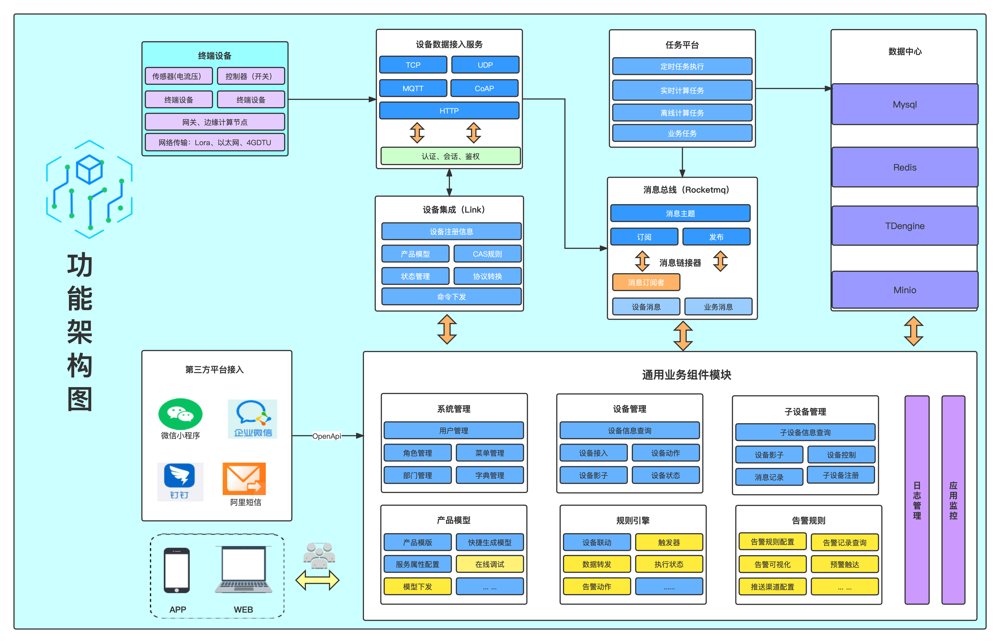
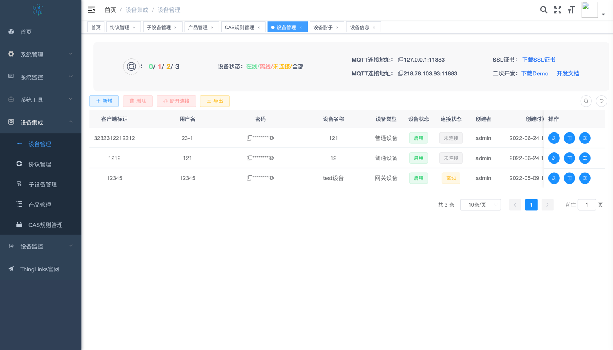
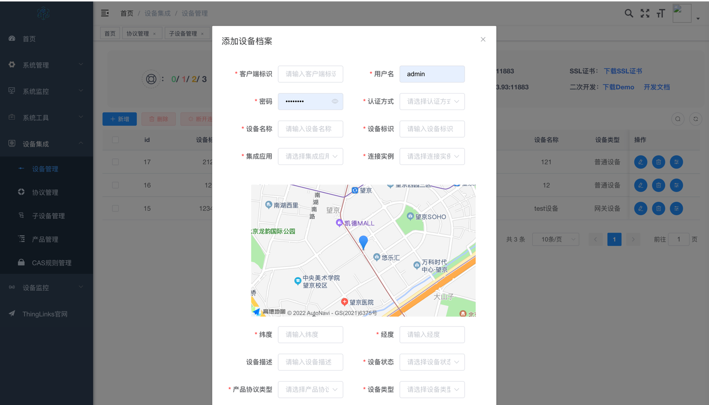
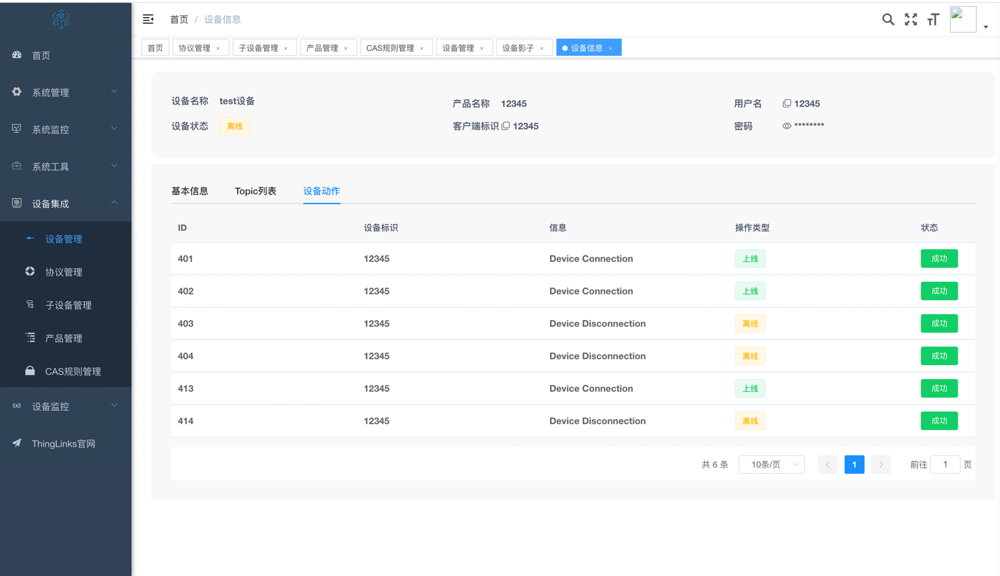
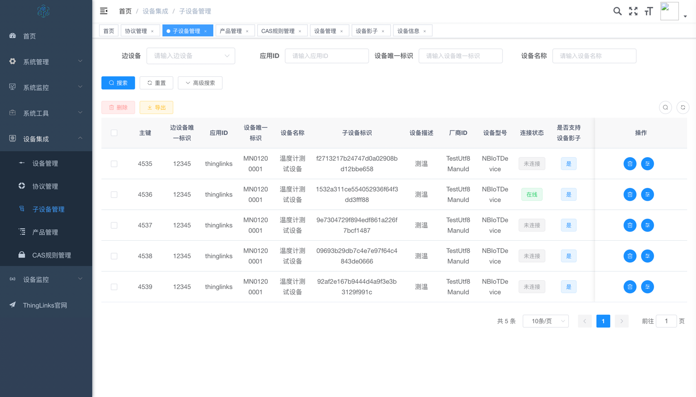
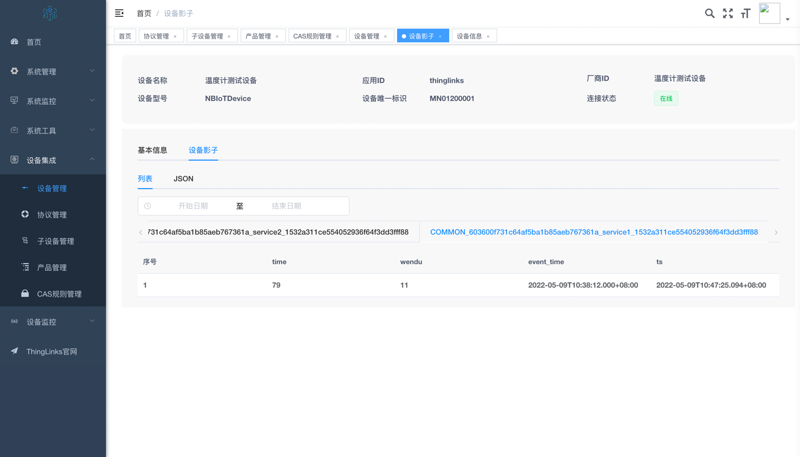
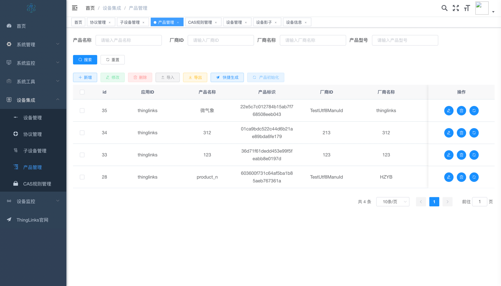
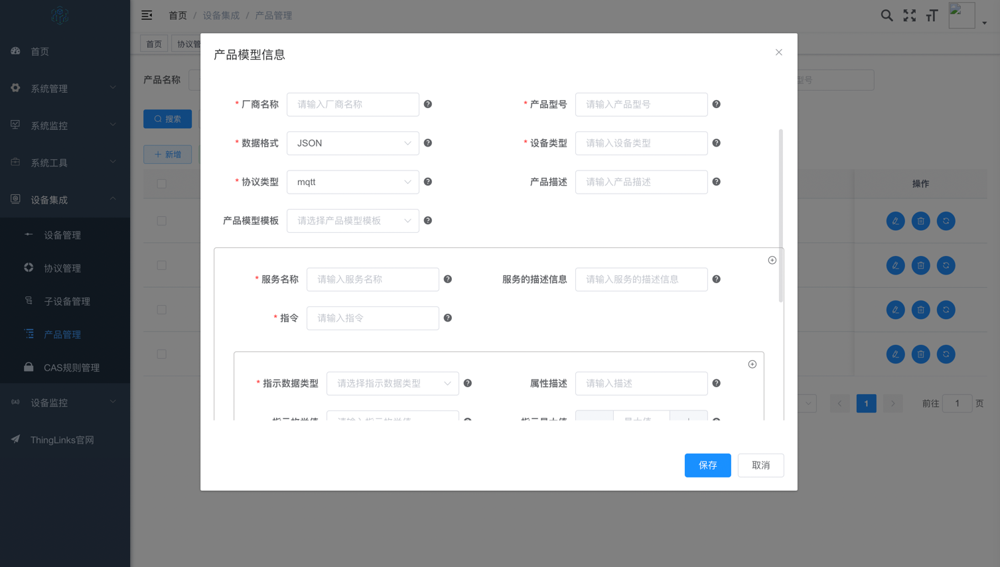
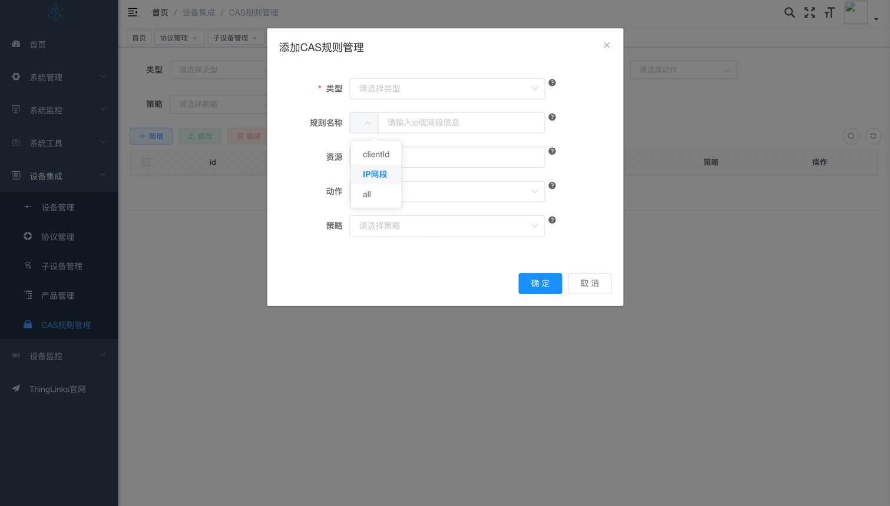

## ThingLinks | [中文文档](README.zh_CN.md)

# Introduction to ThingLinks Platform

This system utilizes the Spring Cloud microservice architecture, providing a high-performance, high-throughput, highly-scalable IoT platform. On a single server, it can support millions of connections. Additionally, it boasts customizable extension features for various protocol interactions and supports plug-in development.

## Tech Stack

1、Adopts a front-end and back-end separation approach using the VUE framework for the frontend.

2、The backend utilizes Spring Boot, Spring Cloud & Alibaba.

3、MqttBroker (supports cluster deployment) is based on Netty, Reactor3, Reactor-netty.

4、The registration center and configuration center are based on Nacos while authentication uses Redis.

5、The traffic control framework is Sentinel and distributed transactions are managed by Seata.

6、The time-series database used is TDengine, an efficient open-source IoT big data platform, capable of handling massive IoT data write-ins and load queries.

## Core Features

Unified product model management, supporting various devices from different manufacturers.

Unified device connection management with multi-protocol adaptability (MQTT, WebSocket, TCP, UDP, CoAP, HTTP, etc).

A flexible rule engine for device alarms, message notifications, and data forwarding.
Device geographic location visualization.

TDengine time-series database design concept: one table per device, one super-table per device type.

## Documentation

- [Official Documentation](https://mqttsnet.yuque.com/gt6zkc/thinglinks?# 《ThingLinks物联网一体化平台》)

## Overall Platform Architecture

## Functional Architecture

## Core Function List

System Management: User Management, Role Management, Menu Management, Department Management, Post Management, Dictionary Management, Parameter Settings, Notifications, Log Management

System Monitoring: Online Users, Scheduled Tasks, Sentinel Console, Nacos Console, Admin Console, Task Scheduling Management

System Tools: Form Builder, Code Generator, System API

Device Integration: Device Management (supports MQTT, WebSocket, and TCP-IP protocols), Sub-device Management, Product Management, Protocol Management, Rule Engine (for device interlinking)

Device Debugging: Real-time Logs, Command Issuance

Rule Engine Message Forwarding: Supports KAFKA, HTTP, PREDICATE, ROCKET_MQ, RABBIT_MQ, MYSQL, MQTT, TOPIC, and LOG nodes.

## Development Roadmap

We are currently focused on the development of the Pro version, with the open-source version lagging behind. Gradual open-sourcing will be done in the future. Stay tuned!

*、Rule engine-device interlinking (development completed, lacking alarm information configuration)

*、APP mobile side-My Devices (in progress)

*、Alarm management (planning: DingTalk push, email push, etc.)

*、Large screen display (client, message publish/subscribe, alarms) (in planning)

## Demo Images

## Business Cooperation & Code Contribution

If you're interested in participating in project development or engaging in business cooperation, please contact the mqttsnet team at mqttsnet@163.com.

## Contributors

Thanks these wonderful people, welcome to join us:   
[贡献者指南](CONTRIBUTING.md)

<!-- ALL-CONTRIBUTORS-LIST:START - Do not remove or modify this section -->
<!-- prettier-ignore-start -->
<!-- markdownlint-disable -->
<table>
  <tbody>
    <tr>
      <td align="center" valign="top" width="14.28%"><a href="https://github.com/xiaonannet"> <b>xiaonannet</b></a> <a href="https://github.com/mqttsnet/thinglinks/commits?author=xiaonannet" title="Code">💻</a> <a href="https://github.com/mqttsnet/thinglinks/commits?author=xiaonannet" title="Documentation">📖</a> <a href="#xiaonannet" title="Design">🎨</a><a href="https://github.com/mqttsnet/thinglinks/commits?author=lvwshuai" title="Bug reports">🐛</a></td>
      <td align="center" valign="top" width="14.28%"><a href="https://github.com/lovely-shisen"> <b>lovely-shisen</b></a> <a href="https://github.com/mqttsnet/thinglinks/commits?author=lovely-shisen" title="Code">💻</a> <a href="https://github.com/mqttsnet/thinglinks/commits?author=lovely-shisen" title="Documentation">📖</a> <a href="#lovely-shisen" title="Design">🎨</a></td>
      <td align="center" valign="top" width="14.28%"><a href="https://github.com/whb-11"> <b>whb-11</b></a> <a href="https://github.com/mqttsnet/thinglinks/commits?author=whb-11" title="Code">💻</a> <a href="https://github.com/mqttsnet/thinglinks/commits?author=whb-11" title="Documentation">📖</a><a href="#lovely-shisen" title="Design">🎨</a></td>
      <td align="center" valign="top" width="14.28%"><a href="https://github.com/kangkaime"> <b>kangkaime</b></a> <a href="https://github.com/mqttsnet/thinglinks/commits?author=kangkaime" title="Code">💻</a> <a href="https://github.com/mqttsnet/thinglinks/commits?author=kangkaime" title="Bug reports">🐛</a></td>      
      <td align="center" valign="top" width="14.28%"><a href="https://github.com/lvwshuai"> <b>lvwshuai</b></a> <a href="https://github.com/mqttsnet/thinglinks/commits?author=lvwshuai" title="Code">💻</a></td>
      <td align="center" valign="top" width="14.28%"><a href="https://github.com/andyz168"> <b>andyz168</b></a> <a href="https://github.com/mqttsnet/thinglinks/commits?author=andyz168" title="Code">💻</a></td>
    </tr>
    <tr>
      <td align="center" valign="top" width="14.28%"><a href="https://github.com/llJam"> <b>llJam</b></a> <a href="https://github.com/mqttsnet/thinglinks/commits?author=llJam" title="Code">💻</a></td>
      <td align="center" valign="top" width="14.28%"><a href="https://github.com/qianmenfei"> <b>qianmenfei</b></a> <a href="https://github.com/mqttsnet/thinglinks/commits?author=qianmenfei" title="Code">💻</a></td>
      <td align="center" valign="top" width="14.28%"><a href="https://github.com/wangfan1997"> <b>wangfan1997</b></a> <a href="https://github.com/mqttsnet/thinglinks/commits?author=wangfan1997" title="Code">💻</a></td>
    </tr>
  </tbody>
</table>

<!-- ALL-CONTRIBUTORS-LIST:END -->

## Related Links

BifroMQ is a high-performance MQTT messaging middleware with a native multi-tenant architecture. Open-sourced by Baidu.

- [Official Website](bifromq.io)
- [Github](https://github.com/baidu/bifromq)

High-efficiency MQTT Broker: SMQTTX

- [Github](https://github.com/quickmsg/smqttx)
- [Gitee](https://gitee.com/quickmsg/smqttx)
- [GitCode](https://gitcode.com/quickmsg/smqttx)

## Issues (Feedback is appreciated)

[issues](https://github.com/mqttsnet/thinglinks/issues)

## Submit a PR

[pr->feat/contrbute](https://github.com/mqttsnet/thinglinks/pulls)

## License

[Apache License, Version 2.0](LICENSE)

[Thanks to JetBrains for providing a free IDEA License](https://www.jetbrains.com)

## Copyright Notice

ThingLinks Open Source Platform adheres to the Apache License, Version 2.0. Commercial use is allowed, but it's imperative to retain attribution and copyright information.
