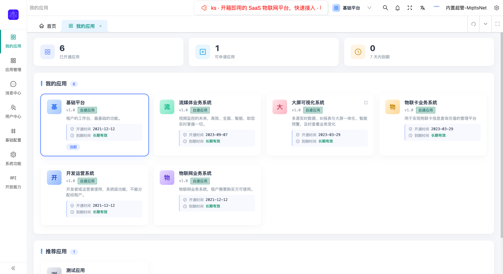

<div align="center">

<a href="https://mqttsnet.com"></a>

# ThingLinks 物联网平台

**多租户 SaaS 云物联网平台 — 高性能 · 高吞吐 · 高扩展**

[English](README.md) | 简体中文 | [日本語](README.ja.md) | [한국어](README.ko.md)

[](https://openjdk.org/)
[](https://spring.io/projects/spring-boot)
[](https://spring.io/projects/spring-cloud)
[](https://vuejs.org/)
[](https://tdengine.com/)
[](LICENSE)
[](https://github.com/mqttsnet/thinglinks/stargazers)
[](https://github.com/mqttsnet/thinglinks/network/members)

<br>

[](https://mqttsnet.com)
[](https://github.com/mqttsnet/thinglinks)
[](https://mqttsnet.com)

</div>

---

## 平台简介

ThingLinks 是一款企业级**多租户 SaaS 云物联网平台**，基于 Spring Cloud 微服务架构构建，具备**高性能、高吞吐、高扩展**的设备接入能力。单机支持**百万级并发连接**，支持插件化扩展开发和多协议适配。

## 系统架构

<details>
<summary><b>架构图</b>（点击展开）</summary>
<br>
<a href="docs/images/architecture.png"></a>
</details>

## 核心特性

| 特性 | 说明 |
|------|------|
| **多租户 SaaS** | 企业级多租户架构，完整租户隔离 |
| **百万级连接** | 单节点支持百万级设备并发连接 |
| **多协议支持** | MQTT、WebSocket、TCP、UDP、CoAP、HTTP、Modbus 等 |
| **设备管理** | 统一产品模型、设备全生命周期管理、设备影子、固件 OTA |
| **规则引擎** | 链式规则、事件编排、场景联动（属性/动作/定时触发） |
| **告警中心** | 多通道告警通知、告警记录与追踪 |
| **SCADA 与可视化** | 资产地图、设备地理位置可视化、SCADA 组态、大屏展示 |
| **时序数据库** | TDengine — 每个设备一张表，每类设备一个超级表 |
| **插件系统** | 插件化开发，支持自定义协议和功能扩展 |
| **消息总线** | 消息治理：格式化、路由、过滤、队列、安全 |
| **协议 SDK** | Java-SDK、C-SDK、Python-SDK 用于协议扩展 |
| **物联卡管理** | SIM 卡通道管理、卡片生命周期管理 |
| **流媒体** | 流媒体服务集成、视频流代理 |
| **AI 数据平台** | 大数据平台、AI 分析、BI 分析、视频中心（规划中） |
| **生态集成** | 华为 IoT、阿里 IoT、Apache BifroMQ 集成 |

## 技术栈


## 快速开始

### 环境要求

| 组件 | 版本 |
|------|------|
| JDK | 17+ |
| Node.js | 18+ |
| MySQL | 8.0+ |
| Redis | 7.x |
| TDengine | 3.x |
| Nacos | 3.x |

### 后端

```bash
# 1. 克隆仓库
git clone https://github.com/mqttsnet/thinglinks.git

# 2. 导入 SQL 脚本（参见 docs/sql/）

# 3. 配置 Nacos、MySQL、Redis、TDengine 连接信息

# 4. 构建
cd thinglinks/thinglinks-cloud
mvn clean install -DskipTests

# 5. 启动服务（gateway、oauth、link 等）
```

### 前端

```bash
# 管理控制台
cd thinglinks-web
pnpm install
pnpm run dev

# 可视化大屏
cd thinglinks-web-visualize
pnpm install
pnpm run dev
```

### Docker

```bash
# 一键部署
docker-compose up -d
```

> 详细部署指南请访问 [mqttsnet.com](https://mqttsnet.com)。

## 项目结构

```
thinglinks/
├── thinglinks-cloud/                # Backend Microservices
│   ├── thinglinks-gateway/          # API Gateway
│   ├── thinglinks-oauth/            # Authentication & Authorization
│   ├── thinglinks-link/             # IoT Device Connectivity Core
│   ├── thinglinks-broker/           # MQTT Broker Integration (BifroMQ)
│   ├── thinglinks-rule/             # Rule Engine
│   ├── thinglinks-mqs/              # Message Queue Service
│   ├── thinglinks-card/             # IoT Card Management
│   ├── thinglinks-mobile/           # Mobile API
│   ├── thinglinks-support/          # Monitor & Admin Services
│   ├── thinglinks-sop-admin/        # DevOps Management
│   ├── thinglinks-generator/        # Code Generator
│   ├── thinglinks-openapi/          # Open API Service
│   ├── thinglinks-public/           # Public Service
│   ├── thinglinks-base/             # Base Platform Service
│   └── thinglinks-sdk/              # SDK
├── thinglinks-web/                  # Admin Console (Vue 3 + Vben)
├── thinglinks-web-visualize/        # Visualization Dashboard (Vue 3 + ECharts)
├── thinglinks-job/                  # Scheduled Task Service (XXL-JOB)
├── bifromq-plugin/                  # Apache BifroMQ Plugin
├── docker/                          # Docker Compose Deployment
├── docs/                            # Documentation & Screenshots
└── scripts/                         # Build & Utility Scripts
```

## 文档

完整文档包括快速入门指南、开发指南、API 参考和部署说明，请访问官方网站：

[](https://mqttsnet.com)

## 🤖 Agent Skills(AI 辅助开发)

官方 **Agent Skills** 把本项目的真实代码结论整理成 AI 代理(Claude Code · Codex · Cursor)按需加载的技能包,按子项目拆分,来自 **[ThingLinks Skills](https://github.com/mqttsnet/thinglinks-skills)** 集合:

```bash
# global (-g); drop -g to install into the current project only
npx skills add mqttsnet/thinglinks-skills@thinglinks-cloud -g    # backend microservices
npx skills add mqttsnet/thinglinks-skills@thinglinks-web -g      # admin console (Vue3)
npx skills add mqttsnet/thinglinks-skills@bifromq-plugin -g      # BifroMQ broker plugins
```

当你编写规则脚本、协议报文、上行/下行链路、物模型、ACL、控制台页面或 BifroMQ 鉴权/事件插件时自动触发。全部技能(含 `thinglinks-util`)见 **[mqttsnet/thinglinks-skills](https://github.com/mqttsnet/thinglinks-skills)**。

## 产品截图

<details>
<summary><b>基础平台</b>（4 张截图）</summary>
<br>
<p>
  <a href="docs/images/pc/login.png"></a>
  <a href="docs/images/pc/basic/myApplication.png"></a>
  <a href="docs/images/pc/basic/openAccessKey.png"></a>
</p>
<p>
  <a href="docs/images/pc/basic/openApi.png"></a>
</p>
</details>

<details>
<summary><b>开发运营系统</b>（7 张截图）</summary>
<br>
<p>
  <a href="docs/images/pc/devOperation/tenant.png"></a>
  <a href="docs/images/pc/devOperation/project.png"></a>
  <a href="docs/images/pc/devOperation/application.png"></a>
</p>
<p>
  <a href="docs/images/pc/devOperation/resource.png"></a>
  <a href="docs/images/pc/devOperation/generator.png"></a>
  <a href="docs/images/pc/devOperation/opsInterface.png"></a>
</p>
<p>
  <a href="docs/images/pc/devOperation/sopIsvInfo.png"></a>
</p>
</details>

<details>
<summary><b>物联网业务系统</b>（15 张截图）</summary>
<br>
<p>
  <a href="docs/images/pc/iotSystem/product.png"></a>
  <a href="docs/images/pc/iotSystem/productDetails.png"></a>
  <a href="docs/images/pc/iotSystem/productService.png"></a>
</p>
<p>
  <a href="docs/images/pc/iotSystem/device.png"></a>
  <a href="docs/images/pc/iotSystem/deviceDebug.png"></a>
  <a href="docs/images/pc/iotSystem/deviceShadow.png"></a>
</p>
<p>
  <a href="docs/images/pc/iotSystem/deviceShadow_1.png"></a>
  <a href="docs/images/pc/iotSystem/assetStats.png"></a>
  <a href="docs/images/pc/iotSystem/assetmap.png"></a>
</p>
<p>
  <a href="docs/images/pc/iotSystem/pluginInfo.png"></a>
  <a href="docs/images/pc/iotSystem/pluginInstance.png"></a>
  <a href="docs/images/pc/iotSystem/engineChained.png"></a>
</p>
<p>
  <a href="docs/images/pc/iotSystem/engineLinkage.png"></a>
  <a href="docs/images/pc/iotSystem/ruleGroovyScript.png"></a>
  <a href="docs/images/pc/iotSystem/scada.png"></a>
</p>
</details>

<details>
<summary><b>物联卡业务系统</b>（2 张截图）</summary>
<br>
<p>
  <a href="docs/images/pc/iotCard/cardChannelInfo.png"></a>
  <a href="docs/images/pc/iotCard/cardSimInfo.png"></a>
</p>
</details>

<details>
<summary><b>大屏可视化系统</b>（1 张截图）</summary>
<br>
<p>
  <a href="docs/images/pc/view/visualization.png"></a>
</p>
</details>

<details>
<summary><b>流媒体业务系统</b>（2 张截图）</summary>
<br>
<p>
  <a href="docs/images/pc/videoSystem/videoMediaServer.png"></a>
  <a href="docs/images/pc/videoSystem/videoStreamProxy.png"></a>
</p>
</details>

<details>
<summary><b>移动端 H5</b>（5 张截图）</summary>
<br>
<p>
  <a href="docs/images/h5/login.jpg"></a>
  <a href="docs/images/h5/index.jpg"></a>
  <a href="docs/images/h5/dashboard.jpg"></a>
  <a href="docs/images/h5/myHome.jpg"></a>
  <a href="docs/images/h5/scene.jpg"></a>
</p>
</details>

## 版本对比

| 功能 | 社区版 | 商业版 | 旗舰版 |
|------|:------:|:------:|:------:|
| 业务层源码 | ✔ 完整（GitHub/Gitee 公开） | ✔ 100% 完整 | ✔ Pro 版 100% 全部 |
| ThingLinks-util 底层库 | ✕ JAR 引用 | ✕ JAR 引用 | ✔ 完整源码 |
| 技术文档 | 社区文档 | 社区文档 | 完整技术 + 架构文档 |
| 私有仓库权限 | ✕ | ✔ | ✔ |
| 修改 package 包名 | ✕ 禁止 | ✔ 允许 | ✔ 不受限制 |
| 修改 Maven groupId | ✕ 禁止 | ✔ 允许 | ✔ 不受限制 |
| 修改作者信息 | ✕ 禁止 | ⚠ 可改，须保留版权 | ✔ 不受限制 |
| 修改版权信息 | ✕ 禁止 | ✕ 须保留 | ✔ 不受限制 |

> **社区版用户请注意：** 根据 Apache 2.0 协议与 ThingLinks 授权协议，社区版源码中的 package 包名、Maven groupId、作者署名及版权声明均不可修改或移除。违反此规定将构成侵权。如需修改标识信息，请升级至商业版或旗舰版。

> **商业版 / 旗舰版授权激活：** 购买后，请将我们提供的授权 ID 填入 [LICENSE-COMMERCIAL](LICENSE-COMMERCIAL) 文件中的授权信息区域，并通过 git commit 提交。git 提交记录将作为授权生效的关键证明。通过 [mqttsnet.com](https://mqttsnet.com) 可验证授权状态。

## 路线图

请查看 [GitHub Milestones](https://github.com/mqttsnet/thinglinks/milestones) 了解我们的功能规划和即将发布的版本。

## Star 趋势

<a href="https://star-history.com/#mqttsnet/thinglinks&Date">
  <picture>
    <source media="(prefers-color-scheme: dark)" srcset="https://api.star-history.com/svg?repos=mqttsnet/thinglinks&type=Date&theme=dark" />
    <source media="(prefers-color-scheme: light)" srcset="https://api.star-history.com/svg?repos=mqttsnet/thinglinks&type=Date" />
    
  </picture>
</a>

## 贡献者

感谢所有为本项目做出贡献的优秀开发者！

<a href="https://github.com/mqttsnet/thinglinks/graphs/contributors">
  
</a>

欢迎参与贡献！请查阅 [贡献者指南](CONTRIBUTING.md)。

## 联系我们

- 商业合作：[mqttsnet@163.com](mailto:mqttsnet@163.com)
- 问题反馈：[GitHub Issues](https://github.com/mqttsnet/thinglinks/issues)
- 提交 PR：[GitHub Pull Requests](https://github.com/mqttsnet/thinglinks/pulls)

> **声明：** 本项目同步镜像至多个代码托管平台。Bug 反馈、功能建议、技术讨论的**唯一官方渠道**为 [GitHub Issues](https://github.com/mqttsnet/thinglinks/issues)，其他平台（Gitee、Gitea 等）提交的 Issue 不予处理。

<table>
  <tr>
    <td align="center">
      <br>
      <sub>微信搜一搜 MqttsNet</sub>
    </td>
  </tr>
</table>

## 致谢

- [Apache BifroMQ](https://github.com/apache/bifromq) — 高性能 MQTT Broker

## 开源协议

ThingLinks 社区版基于 [Apache License 2.0](LICENSE) 开源，附加商业条款详见 [LICENSE-COMMERCIAL](LICENSE-COMMERCIAL)。

商业版 / 旗舰版授权请联系 [mqttsnet@163.com](mailto:mqttsnet@163.com)。

---

<div align="center">

Copyright &copy; 2019-present [MqttsNet](https://mqttsnet.com). All rights reserved.

[感谢 JetBrains 提供免费 IDE 许可](https://www.jetbrains.com)

</div>
