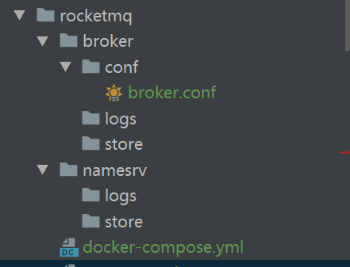

###前提：broker.conf文件修改
```
1.broker.conf文件路径：thinglinks\doc\rocketmq\broker\conf\broker.conf
2.修改下面配置涉及到的IP为自己的IP地址：
namesrvAddr=192.168.2.88:19876
brokerIP1=192.168.2.88
```
##1.需要在rocketmq目录下创建如下目录结构：

##2.将rocketmq整个目录复制到linux服务器上
##3.在rocketmq目录下执行docker命令
```
1.启动基础环境
docker-compose up -d
2.查看启动的容器
docker-compose ps -a 
3.查看创建的镜像
docker-compose images
```
##4.访问rocketmq控制台
http://自己IP:8180/