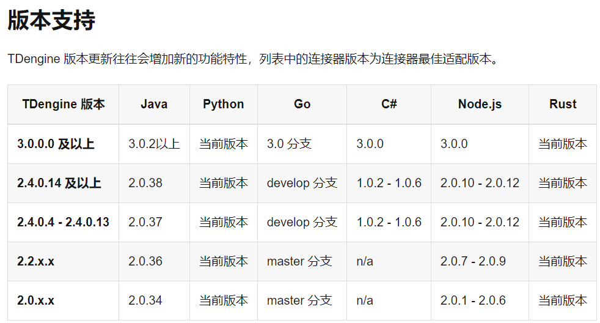
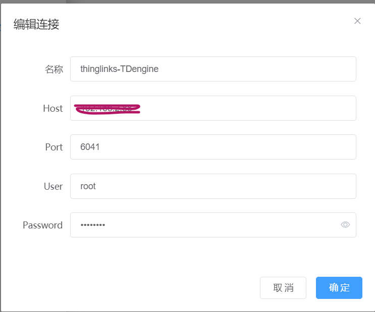
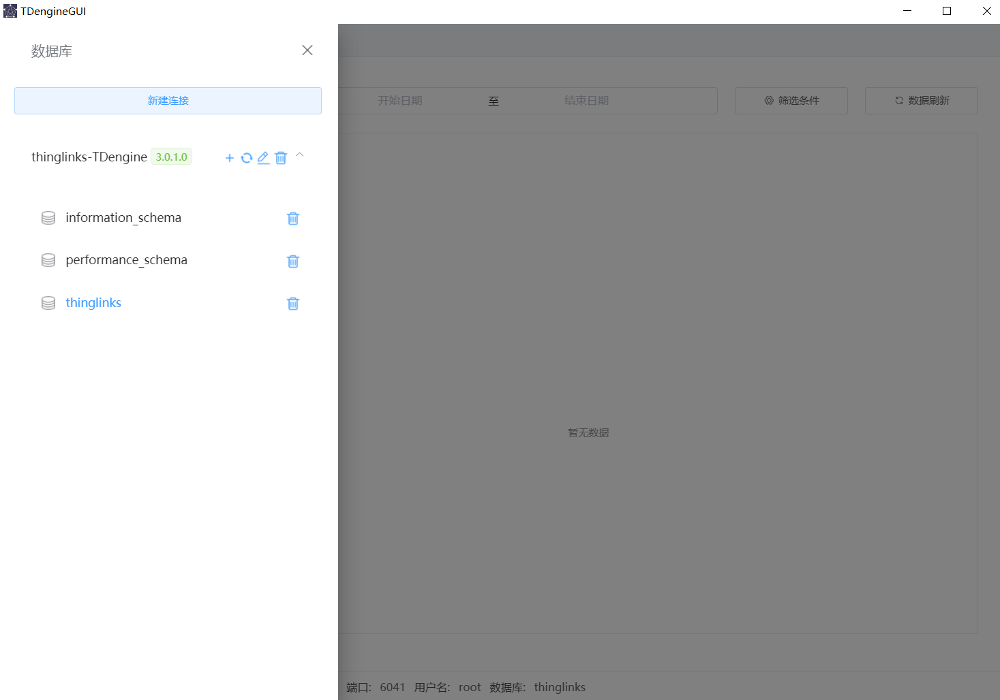
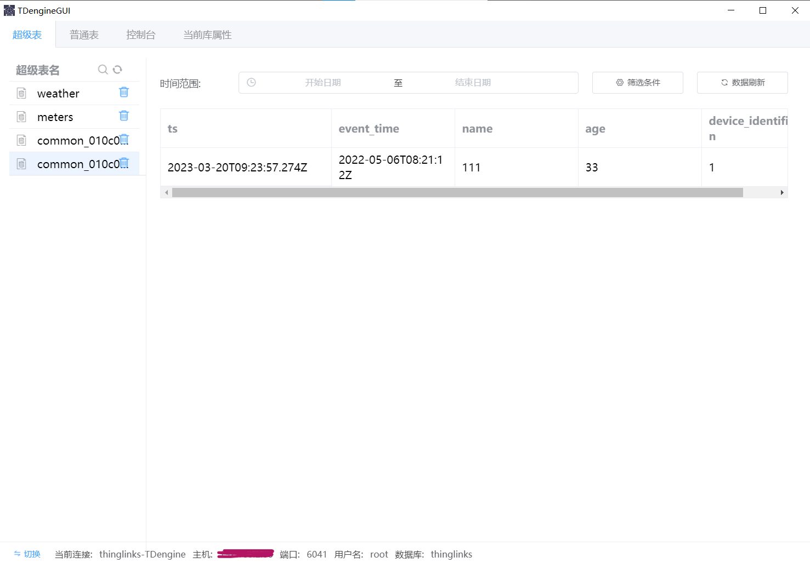

#注意：为避免客户端驱动和服务端不兼容，请使用一致的版本。
[TDengine版本和连接器最佳适配版本的对应关系][https://docs.taosdata.com/connector/]

#TDengine服务端、各连接器、第三方工具TDengineGUI版本选择情况
##1.TDengine的官方Java语言连接器选择3.0.3
```
taos-jdbcdriver是TDengine的官方Java语言连接器
<dependency>
    <groupId>com.taosdata.jdbc</groupId>
    <artifactId>taos-jdbcdriver</artifactId>
    <version>3.0.3</version>
</dependency>
```
##2.TDengine的客户端驱动，即 C/C++连接器(Windows环境安装)
`TDengine-server-3.0.1.0-Windows-x64.exe`
##3.第三方工具TDengineGUI(Windows环境安装)
```
TDengineGUI.Setup.1.0.3.exe
https://github.com/arielyang/TDengineGUI/releases/tag/1.0.3
```
##4.TDengine服务端
`docker pull tdengine/tdengine:3.0.1.0`

#1.安装TDengine服务端
###1. 拉取镜像文件
`docker pull tdengine/tdengine:3.0.1.0`
###2. 创建运行容器
```
1.安装介质目录结构
tdengine
   log
   data
在tdengine目录下创建log、data目录
2.将tdengine整个目录复制到linux服务器上
3.在tdengine目录下执行docker命令
docker run -d --name thinglinks-tdengine  -v ./log:/var/log/taos -v ./data:/var/lib/taos  -p 6030-6049:6030-6049 -p 6030-6049:6030-6049/udp tdengine/tdengine:3.0.1.0
```
###3. 创建thinglinks数据库
```
docker exec -it thinglinks-tdengine /bin/bash
taos
CREATE DATABASE thinglinks KEEP 365 DURATION 10 BUFFER 16 WAL_LEVEL 1;
```
###4. TDengineGUI新建连接



###5. 使用Java Connector连接数据库
`官方相关资料地址：https://docs.taosdata.com/connector/java/`