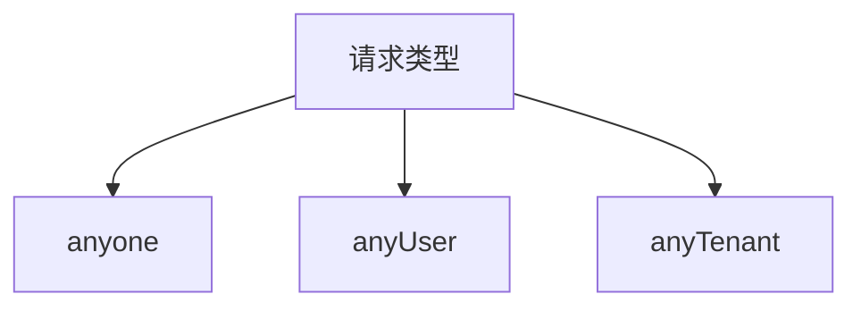

# 接口权限配置规范

## 权限分类说明

## anyone 权限

### 安全要求

- ✅ 必须携带 Tenant ID
- ✅ 必须携带 Access Token（需登录）
- ❌ 不验证URI权限

### 路径匹配规则

pathPatterns:

- /*/anyone/**
- /anyone/**

### 典型使用场景

- 用户个人中心相关接口
- 需要登录但无需细粒度控制的接口

## anyUser 权限

### 安全要求

- ✅ 必须携带 Tenant ID
- ❌ 不需要登录
- ❌ 不验证URI权限

### 路径匹配规则

pathPatterns:

- /*/anyUser/**
- /anyUser/**

### 典型使用场景

- 公共信息查询接口
- 多租户共享的数据接口

## anyTenant 权限

### 安全要求

- ❌ 不需要 Tenant ID
- ❌ 不需要登录
- ❌ 不验证URI权限

### 路径匹配规则

pathPatterns:

- /*/anyTenant/**
- /anyTenant/**

### 典型使用场景

- 全局配置获取接口
- 系统级公共资源访问

