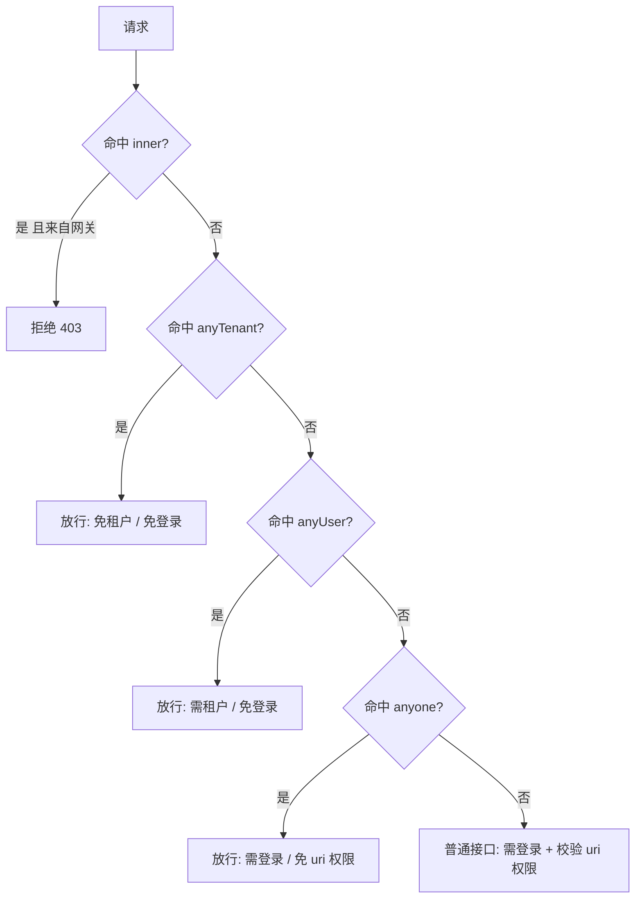

# 接口权限配置规范

网关(`AuthenticationSaInterceptor` + `TokenContextFilter`)按四个维度决定一个请求能否放行、以什么身份放行：

- 是否需要 **Token**（登录）
- 是否需要 **TenantId**（租户上下文，用于切库）
- 是否校验 **uri 权限**
- 是否**允许经网关访问**

据此分成四类。`anyone` / `anyUser` / `anyTenant` 是"放行"清单（命中即降低门槛），`inner` 是"拒绝"清单（命中即只许服务间内部直连）。

配置位置：Nacos `DEFAULT_GROUP/common.yml` 的 `thinglinks.ignore` 段，对应 `IgnoreProperties`。

## 四类对比

| 类别 | Token | TenantId | uri 权限 | 经网关访问 | 典型场景 |
|---|---|---|---|---|---|
| 普通接口 | 需要 | 需要 | 校验 | 允许 | 绝大多数业务接口 |
| **anyone** | 需要 | 需要 | 不校验 | 允许 | 登录用户都可访问、无需细粒度权限 |
| **anyUser** | 不需要 | 需要 | 不校验 | 允许 | 对外免登录但需租户上下文（登出、字典查询、文件下载、HMAC webhook） |
| **anyTenant** | 不需要 | 不需要 | 不校验 | 允许 | 连租户都还没有（验证码、登录、注册、门户） |
| **inner** | 不需要 | 不需要（按需透传） | 不校验 | **禁止** | 服务间 Feign 内部 RPC |

## 核心理念：内部 RPC 不走网关

`@FeignClient(name = "thinglinks-xxx-server")` 用服务名经 Nacos 服务发现**直连**目标服务，**不经过网关**。所以"服务间内部接口"本就不需要网关放行——它需要的恰恰相反：**禁止外部经网关访问**。

历史上这类内部接口被放在 `/anyUser/**` 下，导致被网关"免登录放行"，等于把内网 RPC 接口对公网未授权开放（曾经的 `/anyUser/tds/**` SQL 注入即源于此）。`inner` 前缀就是把"内部 RPC"与"对外免登录接口"彻底分开：

- **anyUser**：网关命中 → 放行（免登录），外部可达。
- **inner**：网关命中 → 拒绝，外部不可达；只有 Feign 直连（不过网关）能调到。

两者**透传语义完全一致**：都不需要用户 Token，但 TenantId 等上下文 header 照常透传（`FeignAddHeaderRequestInterceptor` 注入 → 下游 `HeaderThreadLocalInterceptor` 读取），所以 inner 接口里 `ContextUtil.getDataBase()` 等切库逻辑照常工作。

## 路径形态

每类都配两种形态：

- `/anyUser/**`：网关 `StripPrefix` 剥掉服务前缀后的路径。
- `/*/anyUser/**`：剥前缀前、带服务前缀的路径（如 `/tds/anyUser/tds/insertTableData`）。网关鉴权过滤器在路由前执行，看到的是带前缀形态，故两种都要配。

## 各类详细

### anyone

- 需要 Tenant、需要 Token（登录）、不校验 uri 权限。
- 路径：`/*/anyone/**`、`/anyone/**`
- 场景：用户个人中心等"登录即可、无需细粒度权限"的接口。

### anyUser

- 需要 Tenant、不需要 Token、不校验 uri 权限。
- 路径：`/*/anyUser/**`、`/anyUser/**`
- 可操作租户库（base_xxxx / extend_xxxx）；拿不到 userId / employeeId。
- 场景：对外免登录但需租户上下文，如登出、字典/参数查询、文件下载、带签名的 webhook 入站。

### anyTenant

- 不需要 Tenant、不需要 Token、不校验 uri 权限。
- 路径：`/*/anyTenant/**`、`/anyTenant/**`、`/magic/web/**`
- 拿不到 employeeId，无法切租户库。
- 场景：验证码、登录、注册、门户网站等"连租户都还没有"的接口。

### inner

- 仅服务间 Feign 直连，**禁止经网关访问**（外部命中即被网关拒绝）。
- 路径：`/*/inner/**`、`/inner/**`
- 透传：不需要 Token；TenantId 等上下文 header 由 Feign 透传，可操作租户库。
- 场景：服务间内部 RPC，如时序库写入、设备下行派发、缓存刷新、物模型/产品查询等。
- 新增内部接口约定：控制器 `@RequestMapping("/inner/xxx")` 与对应 `@FeignClient(path = "/inner/xxx")` **必须成对**，否则 404。

## 安全约束

- 内部 RPC 一律用 `/inner` 前缀，**不得**放在 `/anyUser`、`/anyTenant` 下（否则被网关对外放行）。
- 对外免登录接口（anyUser / anyTenant）若涉及写操作或敏感数据，应自带签名/校验（参考 `bridge/ingress` 的 HMAC 模式）。
- `inner` 的拒绝在网关生效；部署上服务端口不对外暴露、外部只能经网关，二者共同保证内部接口不可被外部触达。
